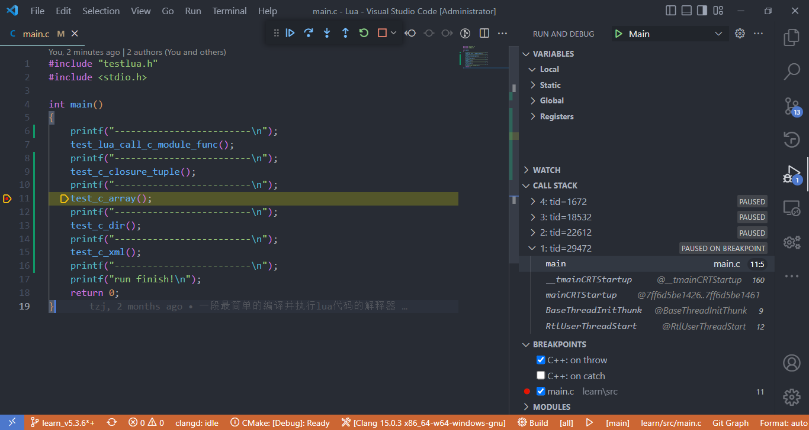

# Lua
The offical implementation of Lua, and I add some comments and test codes.

个人用于研究学习Lua用法，Lua和C交互，Lua源码的仓库，采用Lua5.3.6版本。

## 开发环境

开发环境采用 VSCode + CMake + Mingw64(`Clang x86_64-w64-windows-gnu`) 工具链进行调试。

类似开发环境的搭建请参考[这里](https://github.com/DFVSQY/Vscode_Mingw_GDB_CMake_Clangd_Demo)（`GCC x86_64-w64-mingw32`工具链版本）。

msys2的安装请参考[这里](https://github.com/DFVSQY/VscodeMingw64Demo)，msys2使用pacman包管理器安装 clang toolchain：
```
pacman -S mingw-w64-clang-x86_64-toolchain
```

## Snapshot:
